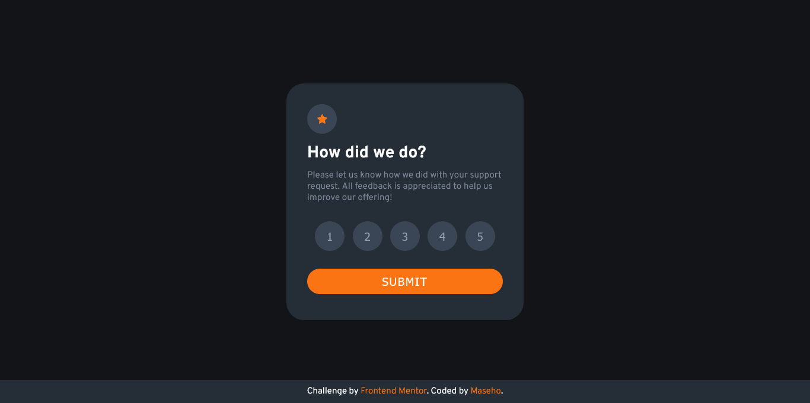
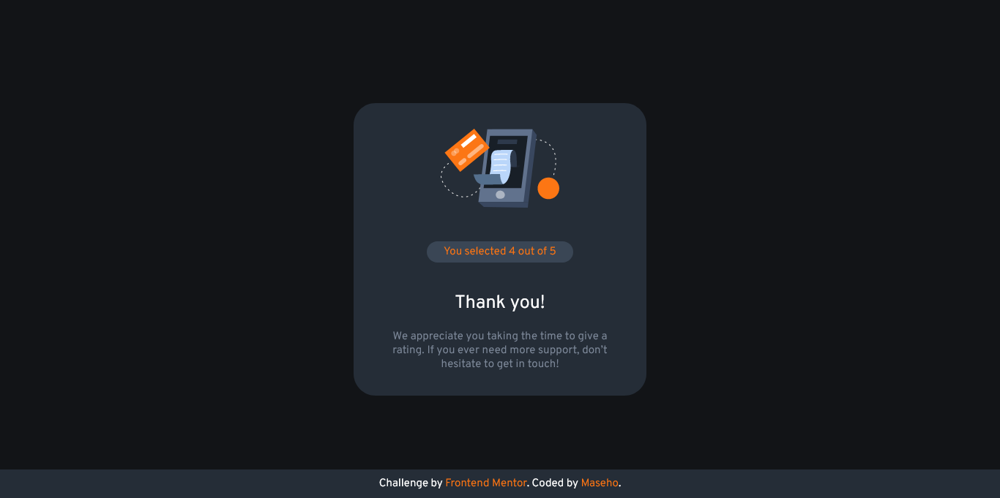

# Frontend Mentor - Interactive rating component solution

This is a solution to the [Interactive rating component challenge on Frontend Mentor](https://www.frontendmentor.io/challenges/interactive-rating-component-koxpeBUmI). Frontend Mentor challenges help you improve your coding skills by building realistic projects. 

## Table of contents

- [Overview](#overview)
  - [The challenge](#the-challenge)
  - [Screenshot](#screenshot)
  - [Links](#links)
- [My process](#my-process)
  - [Built with](#built-with)
  - [Continued development](#continued-development)
  - [Useful resources](#useful-resources)
- [Connect with me](#connect-with-me)

## Overview

### The challenge

Users should be able to:

- View the optimal layout for the app depending on their device's screen size
- See hover states for all interactive elements on the page
- Select and submit a number rating
- See the "Thank you" card state after submitting a rating

### Screenshot
  ## Before

  ## After
  

### Links

- Solution URL: [Add solution URL here](https://your-solution-url.com)
- Live Site URL: [Add live site URL here](https://your-live-site-url.com)

## My process

### Built with

- Semantic HTML5 markup
- CSS custom properties
- Flexbox
- Vanilla JavaScript

### Continued development

- JavaScript
### Useful resources

- [ChatGpt](https://chat.openai.com/?model=text-davinci-002-render-sha) - This helped me for with solving coding questions. I really enjoyed using it and will use it going forward.

## Author

- Linktree - [Maseho](https://linktr.ee/maseho_chipoya)
- Frontend Mentor - [@Maseho](https://www.frontendmentor.io/profile/Maseho)
